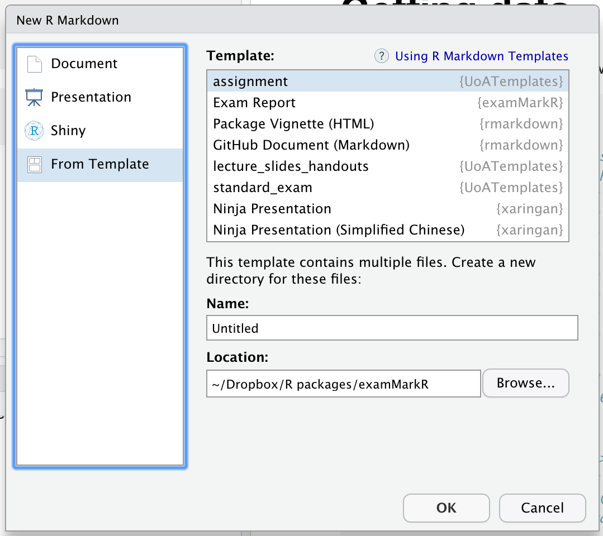

```{r, include = FALSE}
knitr::opts_chunk$set(
  collapse = TRUE,
  comment = "#>", 
  out.width = '100%', 
  fig.width = 10,
  fig.height = 10
)
```

```{r setup, message=FALSE}
library(examMarkR)
library(tidyverse)
```

# Getting the template

The template is an Rmarkdown template:

```{r, fig.cap="Template dialog box", fig.align='center', out.width="50%"}

```

```{r, include=FALSE}
# Get the data
data("marks")
marks
```

# Example grade summary

## Table

```{r}
marks %>% exam_grade_summary(grade) %>% knitr::kable()
```

## Bar-chart

```{r, fig.align='center'}
marks %>% exam_plot_grades(grade)
```

# Exam

```{r, fig.align='center'}
marks %>% exam_plot_profile("^Q", grade)
```

# Scaling

## Method

Discussion of method used. 

```{r}
marks  <- 
  marks %>% 
  mutate(
    norm = exam_norm_glonek(total, a = 0.5, b = 1.1)
  )
```


## Results

```{r}
marks %>% exam_compare_norm(total, norm) %>% knitr::kable()
```

```{r, fig.align='center'}
marks %>% exam_plot_norm(total, norm)
```


# RAA

## Medical supps

The following have a medical supp. 

## Academic supps

The following have an academic supp. 

# Previous years

Chart showing previous exam results

